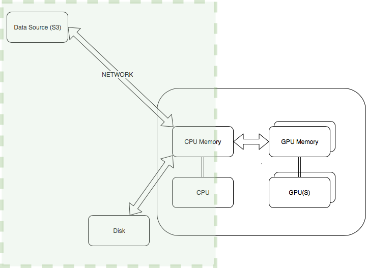
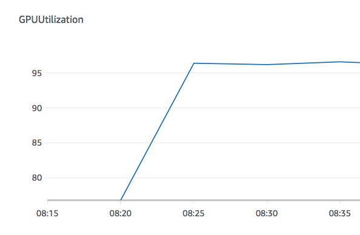

# GPU performance tuning optimising IO -  Illustrated using Caltech 256 dataset

GPUs can significantly speed up deep learning training, and have the potential to reduce training time from weeks to just hours. However in order to fully benefit from the use of GPUS there are many  aspects to consider such as  a) code optimizations to ensure that underlying hardware is fully utilized  b) using the latest high performant libraries and GPU drivers c) optimizing input/output and network operations to ensure that the data is fed to the GPU at the rate that matches its computations d) optimizing communication between GPUS during multi-GPU or distributed training.
 
Here, we will be specifically focusing on optimizations for improving I/O for GPU performance tuning, regardless of the underlying infrastructure or deep learning framework, as shown in Figure1. This is one area where customers stand to benefit the most from, obtaining typically 10X improvements in overall GPU training performance by just optimizing IO processing routines. 

We will be using the [Caltech 256 dataset](http://www.vision.caltech.edu/Image_Datasets/Caltech256/) to demonstrate the results

## Optimizing data loading and preprocessing   

The primary principles behind optimizing data loading and preprocessing are

*  Parallelize operations
*  Make highly used functions as lightweight as possible. 

In this section, we will see some concrete options for increasing parallelism and making commonly used functions as lean as possible.

### Preprocess out of band

Where possible preprocess out of band ahead of time, so you don’t even have to preprocess the data while training so you can make the data available to the GPU faster. This is one of the easiest way to optimize for faster training. This option is a good solution for problems like resizing images, where the output is exactly the same every time. 

### Multiple workers for loading and processing data

TensorFlow, Mxnet Gluon and PyTorch provide data loader libraries for loading data in parallel.  In this Pytorch example , increasing the number of workers from 1 to  approximately  one less that the number of cpus will allow more workers to process items in parallel.  Generally each worker represents one process and uses python multiprocessing , although the implementation details can vary from framework to framework.  The use of multiprocessing pool side steps the python Global Interpreter Lock (GIL) to fully leverage all the CPUs in parallel but it also means that memory utilization increases proportionally to the number of workers as each process has its own copy of the objects in memory. So you could see out of memory exceptions as you start to increase the number of workers , in which case you could use an instance that has more CPU memory where applicable.
 

### Results

 In this demo notebook example [sagemaker.ipynb](sagemaker.ipynb) , we use the Caltech-256 dataset which has ~30600 images,  using ResNet 50 on SageMaker ml.P3.2x large instance. With just 1 worker, it took 260 secs per epoch processing ~100 images per sec in a single gpu. The one with 7 workers took  96 secs per epoch processing ~ 300 images per sec achieving 3 X times improvement. 

Fig: SageMaker metric - GPU utilization for a single worker with peak utilization 50% 

Fig Multiple Worker has average utilization is 95%

You can see how minor changes to the num_workers can speed up data loading and therefore allowing the GPUs to train faster as they spend less time waiting for data. 

Once you maximize utilization on a single GPU only then does it make sense to train on multi-GPU or multi - host distributed GPU training. Hence it is absolutely critical to measure and maximise utilization on a single GPU  before moving onto to advanced techniques. You can see how optimizing the IO data loaders impact GPU utilization.   

## Run samples on  Amazon SageMaker 

See Notebook [sagemaker.ipynb](sagemaker.ipynb)

## License

This library is licensed under the MIT-0 License. See the LICENSE file.

